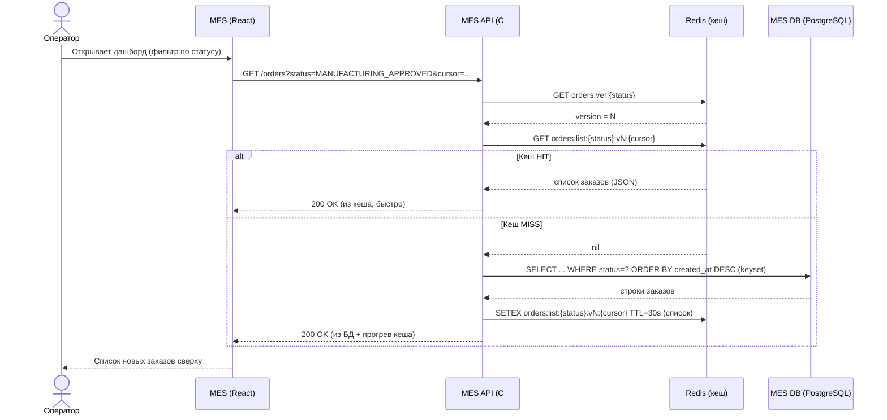
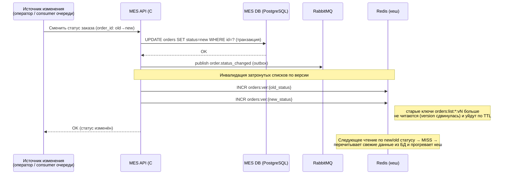

# Task 5 — Sequence-диаграммы кеширования дашборда MES

Кеш: **Redis**, паттерн **Cache-Aside**, инвалидация — **программная (событийная) по версии статуса** + короткий TTL как страховка.
Ключ списка: `orders:list:{status}:v{version}:{cursor}`; версия статуса хранится в `orders:ver:{status}`.

## 1. Чтение списка заказов (Cache-Aside)

## 2. Изменение статуса заказа (запись + инвалидация)

Источник изменения — либо действие оператора (взял/выполнил заказ), либо
сообщение из очереди (напр. PRICE_CALCULATED, MANUFACTURING_APPROVED из CRM).

> Приём «version bump»: вместо удаления множества ключей пагинации инкрементируем
> счётчик версии статуса — все старые страницы этого статуса мгновенно
> «инвалидируются» без сканирования ключей Redis, а протухшие записи удаляются по TTL.
